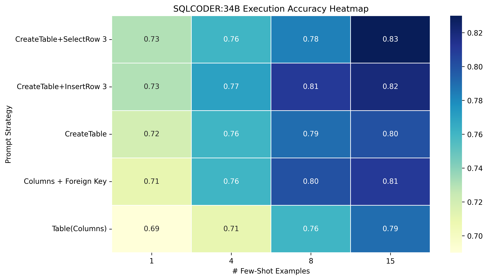

## NL2SQL Project

This project presents **sqlcoder-34b-alpha** performance, a Text-2-SQL model for instruction-based generation of SQL code from natural language queries. In this repository I release the training thanks to different prompt strategy of **SQLCODER:15B** language model and the **34B** version. I also use **LLama2** for several examples.

This project has been trained on a server with 380GB of RAM and is powered by 2 NVIDIA Tesla V100 GPUs, each with 32GB of memory.

### Text2SQL Challenges :
* SQL syntax : there are queries which are easy to express in natural language but the SQL translation may be complex.
* Syntactic ambiguity : A sentence can have mutiple interpretations based on its syntactic structure.
* Database structure : the user's model of the data may not match the database schema
* Max Token limit : it's crucial to be mindful of the token limit, as cutting off important parts of a query might lead to loss of context and potentially impact the model's ability to generate accurate SQL queries 


### Dataset used 

This project utilizes the Chinook dataset, a fictional relational database representing a music store. The Chinook dataset is employed to illustrate various aspects of data analysis and visualization within the scope of this project.

### Examples from sqlcoder-34b-alpha

#### Prompt:

```
TEMPLATE = """ 
### Instructions:
Your task is to convert a question into a SQL query, given a MySQL database schema.
Adhere to these rules:
- **Deliberately go through the question and database schema word by word** to appropriately answer the question
- **Use Table Aliases** to prevent ambiguity. For example, `SELECT table1.col1, table2.col1 FROM table1 JOIN table2 ON table1.id = table2.id`.
- When creating a ratio, always cast the numerator as float

### Input:
Generate a SQL query that answers the question `{query}`.
This query will run on a database whose schema is represented in this string:
{sql_architecture}
### This is some example of output you can query : {few_shot_examples}

### Response:
Based on your instructions, here is the SQL query I have generated to answer the question `{query}`:
```sql
"""
```


#### Input_1 :

```python
query = "Provide a query that shows the most purchased track of 2013."
```

#### Output_1:

```sql
SELECT t.name, CAST(COUNT(il.invoicelineid) AS FLOAT) / COUNT(DISTINCT c.customerid) AS purchase_ratio FROM track AS t JOIN invoiceline AS il ON t.trackid = il.trackid JOIN invoice AS i ON il.invoiceid = i.invoiceid JOIN customer AS c ON i.customerid = c.customerid WHERE YEAR(i.invoicedate) = 2013 GROUP BY t.name ORDER BY purchase_ratio DESC LIMIT 1;
```

#### Input_2 :

```python
query="Retrieve names of all genres and the total number of available tracks for each genre."
```

#### Output_2:

```sql
SELECT g.name AS genre_name, CAST(COUNT(t.trackid) AS FLOAT) / NULLIF((SELECT COUNT(trackid) FROM track), 0) AS track_ratio FROM genre AS g JOIN track AS t ON g.genreid = t.genreid GROUP BY g.name ORDER BY track_ratio DESC NULLS LAST;
```

## Different prompt Results : 


The chart depicts the execution accuracy on the Chinook dataset for 50 queries. Execution accuracy refers to the number of queries whose response is valid compared to the total number of queries.




These results indicate LLMs are able to quickly learn table relationships from a small number of in-domain demonstrations, however, it is more challenging to obtain table content knowledge from demonstration examples.

